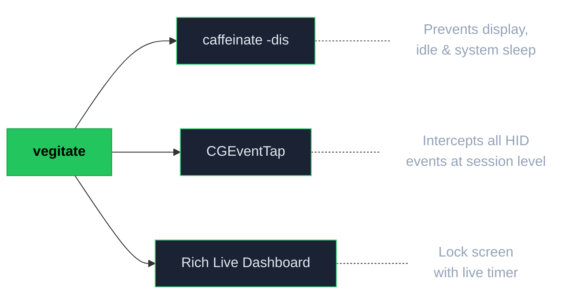
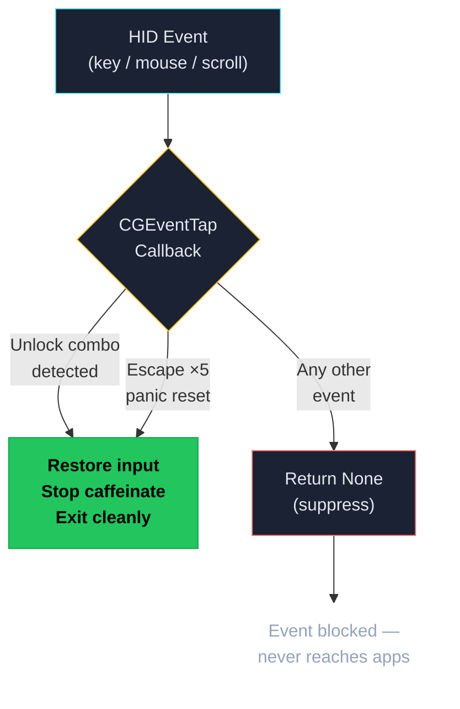

# vegitate

**Keep your Mac awake and displaying output while locking all keyboard and mouse input.**

Perfect for leaving AI agents, builds, or long-running tasks unattended — the screen stays on, but nobody can type, click, or scroll until you press your secret key combination.


## What it does

1. **Caffeinate** — wraps macOS `caffeinate -dis` to prevent display, idle, and system sleep
2. **Lock input** — creates a system-wide `CGEventTap` that intercepts and suppresses all keyboard and mouse events
3. **Unlock combo** — only your secret key combination gets through, restoring everything to normal
4. **Live dashboard** — shows a live-updating lock screen with session timer

## Install

### Homebrew

```bash
brew tap silent-lad/vegitate
brew install vegitate
```

### pip

```bash
pip install vegitate
```

### From source

```bash
git clone https://github.com/silent-lad/homebrew-vegitate.git
cd vegitate
python -m venv .venv && source .venv/bin/activate
pip install .
```

## Usage

```bash
# Lock with default combo (ctrl + cmd + u)
vegitate

# Custom unlock combo
vegitate -c ctrl+shift+q

# Allow mouse cursor movement (clicks still blocked)
vegitate --allow-mouse-move

# Skip caffeinate (if you run it separately)
vegitate --no-caffeinate
```

### First run — grant Accessibility permission

macOS requires Accessibility permission to intercept input events. On first run:

1. Open **System Settings → Privacy & Security → Accessibility**
2. Toggle **ON** for your terminal app (Terminal, iTerm2, Warp, etc.)
3. Re-run `vegitate`

You only need to do this once.

## Options

| Flag / Command        | Default      | Description                                  |
| --------------------- | ------------ | -------------------------------------------- |
| `-c`, `--combo COMBO` | `ctrl+cmd+u` | Unlock key combination                       |
| `--allow-mouse-move`  | off          | Allow cursor movement (clicks still blocked) |
| `--no-caffeinate`     | off          | Skip starting caffeinate                     |
| `-V`, `--version`     | —            | Show version and exit                        |
| `init`                | —            | Generate default config at `~/.config/vegitate/config.toml` |

### Combo format

Combos are written as `modifier+modifier+key`. At least one modifier and exactly one regular key are required.

**Modifiers:** `ctrl`, `cmd` (or `command`), `shift`, `alt` (or `option`, `opt`)

**Keys:** `a`–`z`, `0`–`9`, `f1`–`f12`, `space`, `return`, `escape`, `tab`, `delete`

```bash
vegitate -c ctrl+cmd+u          # default
vegitate -c cmd+shift+escape    # three-finger escape
vegitate -c ctrl+alt+shift+q    # quad-key combo
vegitate -c cmd+shift+l         # simple lock/unlock
```

## Config file

vegitate reads settings from `~/.config/vegitate/config.toml`. Generate the default config:

```bash
vegitate init
```

This creates:

```toml
# ~/.config/vegitate/config.toml

# Unlock key combination
combo = "ctrl+cmd+u"

# Allow mouse cursor movement while locked
allow_mouse_move = false

# Start caffeinate to prevent sleep
caffeinate = true

# Panic reset: press a key rapidly N times to force-unlock
# Set panic_taps = 0 to disable
panic_key = "escape"
panic_taps = 5
panic_window = 2.0   # seconds
```

CLI flags always override config values. Edit the file to change your defaults, and pass flags for one-off overrides.

## Hard reset

By default, there's a **built-in panic sequence** that always works:

> **Press Escape 5 times rapidly** (within 2 seconds)

This immediately unlocks input and stops vegitate. You can customise which key, how many taps, and the time window in the config file. Set `panic_taps = 0` to disable it entirely.

You can also kill the process from another terminal or SSH:

```bash
pkill -f vegitate
```

## How it works





- `CGEventTapCreate` at `kCGSessionEventTap` intercepts events before any application sees them
- Returning `None` from the callback suppresses the event entirely
- The unlock combo is detected inside the callback itself, so it works even while everything else is blocked
- If macOS disables the tap (timeout), it is automatically re-enabled

## Requirements

- macOS (uses Quartz framework — no Linux/Windows support)
- Python 3.10+
- Accessibility permission for your terminal app

## License

MIT — see [LICENSE](LICENSE)
